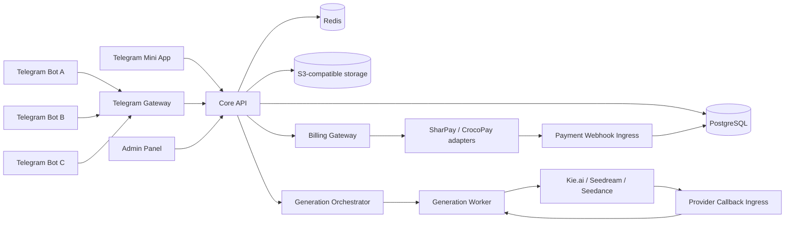
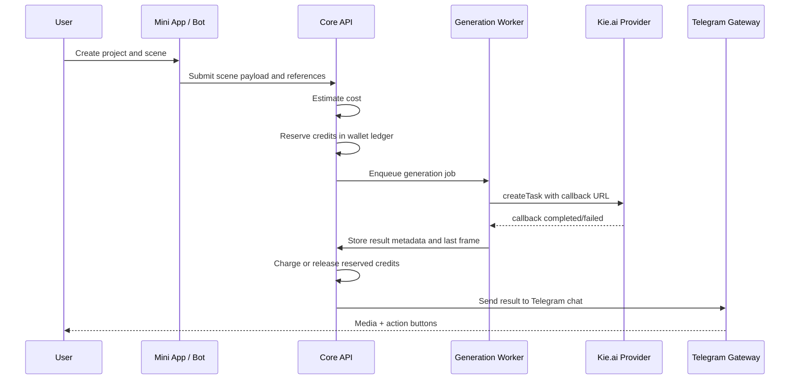

# AdultGen MVP Architecture

## Product thesis

AdultGen is a Telegram-first AI media platform. The user creates cinematic adult-oriented image/video projects from text, saved avatar references, a main frame, and optional additional image/video/audio references. Telegram sends generation results back to the user; the Mini App is the richer UI for projects, feed, profile, billing, and partner tools.

The codebase must treat Telegram bots as replaceable gateways. Users, balances, subscriptions, payments, projects, publications, media metadata, and audit logs belong to the core backend, not to any single bot.

## Non-negotiable constraints

1. **Bot mirrors are channels, not owners of data.** A new Telegram bot can be connected to the same backend without losing user balances or publications.
2. **Canonical identity is `telegram_user_id`.** Do not scope user identity by bot ID.
3. **Wallet is ledger-based.** Never trust a mutable `users.balance` as source of truth.
4. **Payment webhooks are append-only.** Save raw webhook bytes before business processing.
5. **Generation is asynchronous.** Handlers enqueue jobs and return quickly.
6. **Temporary media expires after 24 hours.** Published profile/feed works move to permanent storage.
7. **Adult content requires a gate and moderation controls.** Explicit feed access requires a recorded 18+ acceptance.
8. **Mirrors are disaster recovery / channel continuity, not moderation evasion.** Each connected bot must still follow platform and provider rules.

## High-level system



## Runtime applications

The first release can be a modular monolith repository deployed as several processes.

```text
apps/
├── core_api                 # users, wallets, projects, feed, admin-facing API
├── mini_app_api             # Telegram Mini App auth and public UI API
├── telegram_gateway         # one process can serve many bot channels
├── generation_worker        # async provider jobs and result processing
├── composition_worker       # FFmpeg scene assembly for experimental multi-scene mode
├── billing_gateway          # checkout page and provider adapter entrypoints
├── payment_webhook_ingress  # raw immutable webhook capture
├── payment_worker           # idempotent payment status processing
├── media_worker             # TTL cleanup, permanent copy, preview/blur generation
├── broadcast_worker         # segmented Telegram broadcasts
├── scheduler                # recurring cleanup, subscription renewal, payout checks
└── admin_api                # admin/moderation endpoints
```

## Domain modules

```text
domains/
├── users
├── auth
├── telegram_channels
├── wallets
├── subscriptions
├── payments
├── referrals
├── partner_payouts
├── projects
├── scenes
├── avatar_profiles
├── ai_characters
├── generations
├── media
├── publications
├── feed
├── reactions
├── collections
├── moderation
├── support
├── broadcasts
└── audit
```

## Frontend surfaces

### Telegram bot

Core actions:

- `/start` and mirror-aware onboarding.
- Open Mini App.
- Receive user uploads when needed.
- Notify generation completion with the original media file.
- Inline actions: publish, repeat, continue scene, open project, support.
- Balance and payment entry points.
- Basic support and admin commands.

### Mini App

Bottom navigation:

```text
Главная | Лента | Создать | Проекты | Профиль
```

Additional pages:

- Balance / subscription.
- My avatars.
- Saved collection.
- Partner cabinet.
- Support.
- 18+ settings.

## Main generation flow



## Generation modes

### MVP stable mode

One finished clip up to 15 seconds.

Inputs:

- free text scene description;
- selected saved avatar profile;
- main frame;
- additional references;
- optional video/audio references;
- duration and aspect ratio;
- camera and motion notes.

### Experimental multi-scene mode

The user manually creates scenes. The system stores strict continuity between scenes:

- avatar profile;
- face/reference set;
- outfit notes;
- location notes;
- lighting notes;
- props notes;
- direction of motion;
- last frame from the previous scene.

Scene assembly is handled by the composition worker with FFmpeg only after the user approves scene outputs.

## AI characters

`AICharacter` means a role-based AI chat: director, prompt engineer, psychologist, etc. It is not the saved visual avatar.

For MVP, AI is optional and manually invoked. The core generation flow must work without LLM calls.

Default first character:

```text
AI Director
- improves scene description;
- suggests camera/motion notes;
- checks continuity conflicts;
- prepares prompt text;
- writes output back into the project only after explicit user action.
```

## Payment architecture

Payment providers are adapters behind `PaymentProvider`:

```text
SharPayProvider
CrocoPayProvider
```

The billing gateway creates one-time checkout links and never trusts client-selected amounts.

Flow:

1. User selects a package/subscription.
2. Core API creates `PaymentOrder`.
3. Billing Gateway creates provider invoice/payment.
4. User pays on hosted or provider checkout page.
5. Payment Webhook Ingress stores raw webhook bytes.
6. Payment Worker verifies signature/status and posts ledger entries.
7. Telegram Gateway notifies user.

Provider activation is a business/compliance decision. The code must support both adapters but not assume any provider will approve every adult-content use case.

## Feed architecture

One global feed. No comments and no subscriptions in MVP.

Actions:

- like;
- save to Mini App collection;
- remix with own avatar/references;
- open author profile;
- report;
- admin hide/restore/blur/boost.

Feed is manually swiped. No auto-rotation to next item.

Ranking inputs:

- freshness;
- likes/view ratio;
- saves;
- remixes;
- completion/watch events;
- reports penalty;
- admin boost;
- author frequency cap;
- per-user repeat penalty.

## Storage rules

- Temporary generation media: 24 hours.
- Results are sent to Telegram chat immediately.
- Published profile/feed media: permanent until user/admin deletion.
- Deleted references and avatar files should be physically removed.
- Financial, webhook, audit, and minimal generation metadata remain immutable or append-only.

## Admin panel scope

MVP uses one superadmin, but internal permissions are still modeled for future split roles.

Sections:

- users;
- balances and ledger;
- payments;
- immutable webhook logs;
- generations;
- models and pricing;
- subscriptions;
- promo codes;
- referrals;
- partner payouts;
- publications/feed;
- reports/moderation cases;
- broadcasts;
- bot mirrors;
- media retention;
- system settings;
- admin audit.
