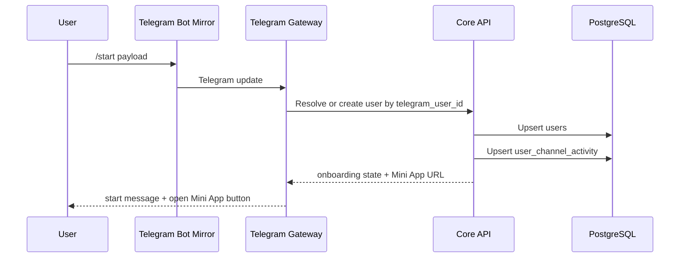
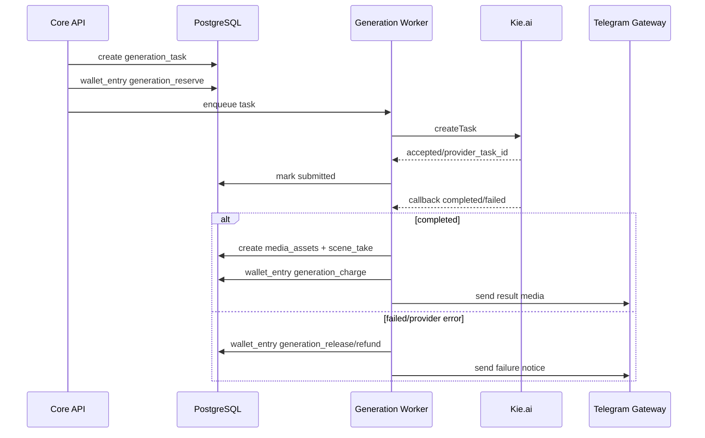
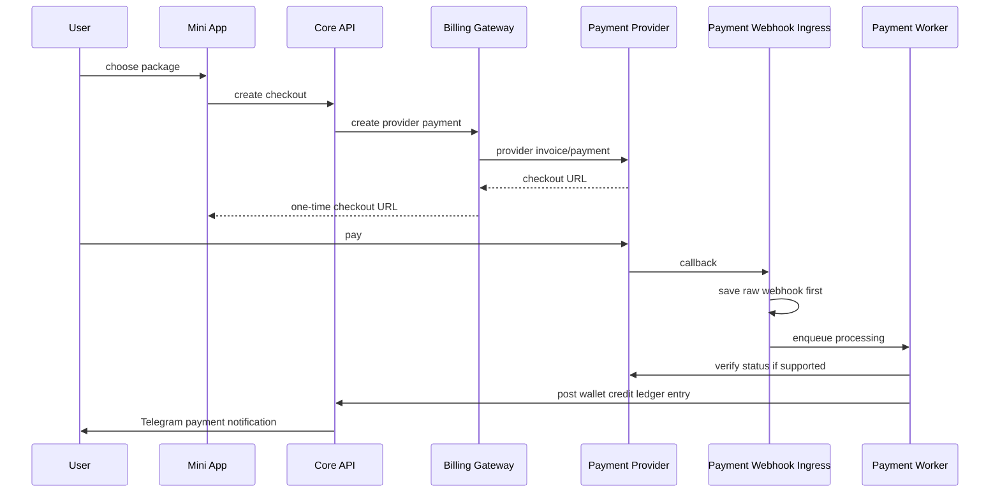

# AdultGen Operational Flows

## 1. New user through any bot mirror



Rules:

- `telegram_user_id` is canonical.
- `start_payload` can attribute referral/profile navigation.
- Never create duplicate user records per bot.

## 2. Adult gate

```text
User opens feed
      ↓
Core API checks adult_consents
      ↓
No consent: show gate
      ↓
User confirms 18+
      ↓
Store policy version and timestamp
      ↓
Allow feed with user's blur setting
```

Minimum gate copy must say that the user confirms they are an adult and chooses to view adult material. Store policy version so changes can force re-consent.

## 3. Create avatar profile

```text
Mini App: My avatars
      ↓
Create avatar profile
      ↓
Upload 1..N reference photos
      ↓
Store as media_assets + avatar_references
      ↓
User can attach avatar profile to scenes
```

MVP keeps avatar as a photo set only. No public avatar marketplace.

## 4. Create project and scenes

```text
Create project
      ↓
Add scene manually
      ↓
Add prompt, duration, format, camera/action/audio notes
      ↓
Attach avatar profile
      ↓
Attach main frame
      ↓
Attach additional references
      ↓
Estimate cost
      ↓
Start generation
```

The AI Director is optional and manually invoked. Base flow must not depend on LLM.

## 5. Cost reservation and generation



Idempotency:

- one active `operation_id` per reserve/charge/release set;
- unique `(provider, provider_task_id)`;
- repeated provider callbacks do not charge twice;
- Telegram delivery retries do not create new charges.

## 6. Generation result delivery

User receives generated image/video in Telegram chat.

Buttons:

```text
[Опубликовать]
[Повторить генерацию]
[Продолжить сцену]
[Открыть проект]
```

Failure with refund:

```text
[Повторить]
[Изменить параметры]
[Поддержка]
```

Store delivery metadata:

```text
NotificationDelivery
- user_id
- channel_id
- generation_id
- telegram_chat_id
- telegram_message_id
- status
- attempts
- last_error
```

## 7. Temporary media cleanup

```text
Generation completed
      ↓
Send to Telegram
      ↓
Store temp media for 24h
      ↓
If user publishes: copy to permanent bucket
      ↓
If not published: delete temp object
      ↓
Keep metadata and telegram_file_id
```

Objects eligible for deletion:

- temporary generated images/videos after 24h;
- failed duplicate takes after 24h;
- deleted avatar references immediately or via short cleanup queue.

Objects not removed by TTL:

- payment webhook raw logs;
- wallet entries;
- admin audit;
- payment orders;
- minimal generation metadata.

## 8. Publish to profile or feed

```text
User taps Publish
      ↓
Select visibility: profile or feed
      ↓
Set title/description
      ↓
Set explicit and blur flags
      ↓
Set allow_remix
      ↓
Core API copies media to permanent bucket
      ↓
Create publication
      ↓
Feed ranking picks it up if visibility=feed
```

Admin can later:

- hide;
- restore;
- delete;
- force blur;
- exclude from recommendations;
- boost;
- disable remix.

## 9. Remix from feed

```text
User taps Create similar
      ↓
System creates new project
      ↓
Copy public scene structure and public prompt/style metadata
      ↓
Do NOT copy author's private avatar references or media references
      ↓
User selects own avatar/main frame/references
      ↓
Start generation normally
```

Create `remix_sources` for analytics and attribution.

## 10. Like and save

Like:

- creates `publication_likes` row;
- duplicate click toggles/remove;
- used for feed scoring.

Save:

- creates `saved_publications` row;
- no media copy;
- if publication is deleted/hidden, collection item becomes unavailable or disappears.

## 11. Payment checkout



Hard rules:

- do not trust redirect success;
- do not trust client-side amount;
- do not process a webhook before raw save;
- do not credit twice for duplicate callbacks.

## 12. Partner commission

```text
Successful payment
      ↓
Find referral relation
      ↓
If first payment: 20%
Else if within 90 days: 5%
      ↓
Create partner_commission pending
      ↓
After protection period: available
      ↓
Partner requests payout
      ↓
Move available -> frozen
      ↓
Admin pays manually
      ↓
Mark paid with audit event
```

Refund/chargeback creates reverse commission and can freeze partner balance.

## 13. Broadcast

```text
Admin creates broadcast
      ↓
Select text/photo/video + buttons
      ↓
Set audience filters
      ↓
Create audience snapshot
      ↓
Queue batches
      ↓
Send through each user's last active reachable bot channel
      ↓
Track delivery/errors/blocked bot
```

Filters:

- paying / non-paying;
- active subscription;
- balance range;
- last activity;
- bot mirror;
- feed users;
- partners.

## 14. Admin moderation

Every admin mutation requires reason and audit entry.

Actions:

```text
hide publication
restore publication
delete publication
force blur
boost/exclude from feed
block user generation
block user feed publishing
manual wallet adjustment
approve/reject payout
change pricing
connect/disable bot mirror
```

## 15. Mirror failover

If one bot is blocked/unavailable:

1. Admin connects new `telegram_channel`.
2. Mini App and public links are updated to the active bot.
3. Returning users are resolved by `telegram_user_id`.
4. Balances and profiles are preserved.

Do not automatically rotate or spam users through mirrors. Use mirrors as channel continuity, not platform-rule bypass.
