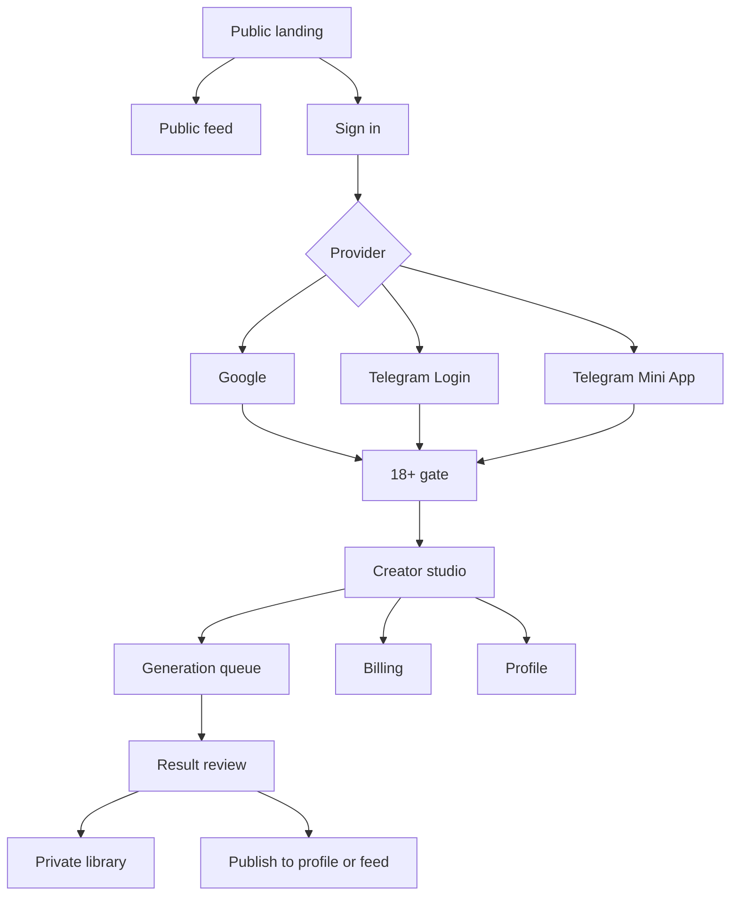
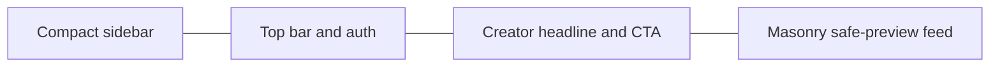
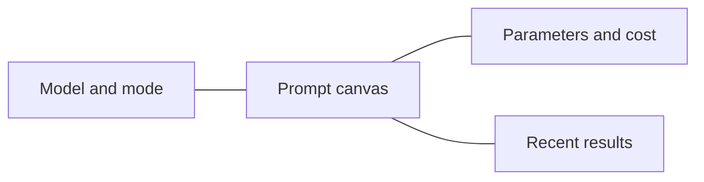

# AdultGen web product brief

Status: approved direction for the first standalone web implementation.

This brief replaces the removed frontend. The implementation must be new code and may not restore or copy the rejected UI.

## Product direction

AdultGen is a dark creator workspace for adult AI image and video generation. The visual direction combines:

- Leonardo-style creator ergonomics: media-first navigation, clear model selection, visible credit cost, and fast iteration;
- the supplied Stellar Content Feed reference: near-black surfaces, restrained neon-magenta accents, cyan state signals, dense editorial cards, and a compact technical shell;
- CreatePorn-style directness: the primary generation action and adult boundary are unambiguous, without copying branding, text, imagery, or layout.

The product must feel premium and controlled, not like a generic admin template. Explicit media remains blurred until the adult gate is accepted and the user deliberately reveals it.

## Product flow map

## Information architecture

| Route | Job | Authentication |
|---|---|---|
| `/` | Public product landing and curated safe previews | Optional |
| `/feed` | Masonry discovery feed with adult blur controls | Optional; consent to reveal |
| `/studio` | Image/video composer with dynamic model options | Required |
| `/generations` | Generation queue, status, results, retry/publish actions | Required |
| `/projects` | Projects and scene organization | Required |
| `/avatars` | Private reference identities and uploads | Required |
| `/billing` | Wallet, credit packages, checkout | Required |
| `/profile` | Public identity, visibility, published work | Required |
| `/admin` | Moderation and operational controls | Admin token |

## Wireframes

### Public landing and feed

- Sidebar: brand, Explore, Studio, Generations, Projects, Assets, Billing.
- Top bar: search, credit state when signed in, sign-in/profile control.
- Landing hero: one compact statement and immediate create CTA; no oversized marketing page.
- Feed cards: artwork, media type/model badges, creator, save/remix actions, blur/reveal state.

### Auth and adult gate

- Centered modal over the product shell.
- Provider options: Google Identity Services and Telegram Login Widget.
- Telegram Mini App sessions bootstrap automatically from verified `initData`.
- The 18+ gate is a separate recorded consent step after authentication.
- Consent copy clearly prohibits minors, non-consensual imagery, public-figure sexualization, coercion, and other policy violations.

### Generation composer

- Model choice drives allowed modes and fields.
- Reference upload areas only appear when supported by the selected operation.
- Cost, balance impact, safety status, and launch action stay visible.
- Mobile order: model, prompt, references, parameters, cost, launch.

### Billing, profile, and admin

- Billing: wallet summary first, then packages and provider hand-off.
- Profile: identity and visibility settings beside a publication grid.
- Admin: separate visual boundary, explicit token lock, moderation queue, and audit-oriented actions.

## Component system

Use React + TypeScript + Vite with a repository-owned component layer and no runtime UI framework.

Core primitives:

- `Button`, `IconButton`, `Badge`, `Panel`, `Field`, `Select`, `Toggle`, `Modal`, `Toast`;
- `AppShell`, `Sidebar`, `TopBar`, `MobileDock`;
- `MediaCard`, `GenerationCard`, `EmptyState`, `Skeleton`;
- `AuthDialog`, `AdultGate`, `ModelPicker`, `ReferenceDropzone`, `CostSummary`.

Design tokens:

- canvas `#08090b`, panel `#111318`, elevated `#171a21`;
- primary magenta `#ff3b9d`, secondary violet `#8b5cf6`, signal cyan `#25d9f8`;
- body text `#f5f5f7`, secondary `#9ca3af`, borders `rgba(255,255,255,.1)`;
- compact radii from 8 to 16 px, large readable controls, visible focus rings;
- display typography remains modern and clean; monospace is reserved for state labels and telemetry.

## Accessibility and responsive rules

- Keyboard-complete navigation and dialogs; no click-only controls.
- Focus-visible states meet contrast requirements.
- Minimum 44 px interactive targets on touch screens.
- CSS honors `prefers-reduced-motion`.
- Desktop sidebar collapses below 1100 px; a mobile dock replaces it below 760 px.
- Adult blur state cannot be disabled only through CSS or local client state for protected API actions.

## E2E test plan

1. Public routes render without a session and protected routes open auth.
2. Google credential success/failure and Telegram payload success/failure are handled without leaking provider tokens.
3. Telegram Mini App startup exchanges verified `initData` for a Core JWT.
4. A new session must accept the current adult policy before generation or explicit reveal.
5. Model switching changes visible controls and never submits forbidden provider fields.
6. Generation creates a task, shows reserve cost, polls status, renders results, and exposes publish/import actions.
7. Insufficient balance leads to billing without losing composer state.
8. Billing creates an owned order and only opens the backend-returned provider URL.
9. Profile visibility and publication state survive reload.
10. Admin UI stays locked without `ADMIN_API_TOKEN` and writes reasons for mutations.
11. Mobile navigation, 360 px composer layout, keyboard focus, and reduced motion are covered.
12. CI runs unit/component tests, TypeScript, production build, Ruff, and Pytest.

## Release boundaries

- Initial PRs provide a staging-ready UI and authentication contract, not an unconditional public paid launch.
- Google OAuth requires a configured web client ID and allowed origin.
- Telegram Login requires a configured bot username/domain and bot token.
- Provider/payment adult-category approval, real callbacks, and production media derivatives remain launch gates.
